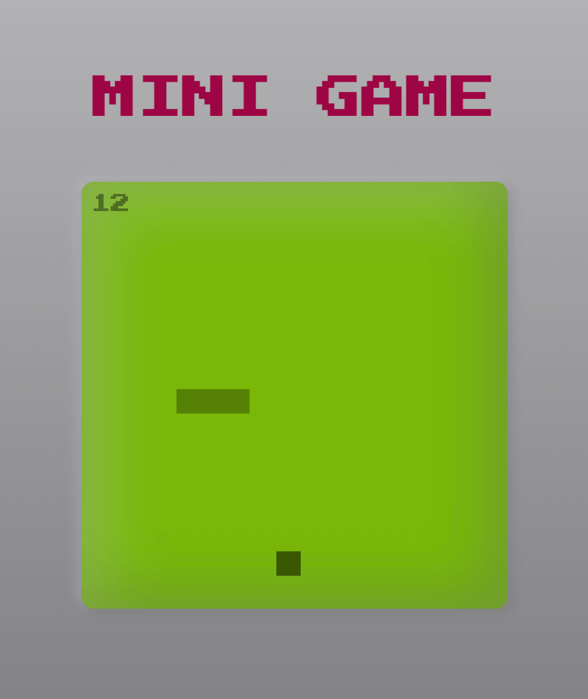

# Mini Game

A mini game built with HTML, CSS, Javascript

## Demo

[Play Now](https://emanuelefavero.github.io/mini-game/)

#### Screenshot

## How to play

1. Click the play button or press the space bar to start the game
2. Use the arrow keys on Desktop or swipe on mobile to move the player left and right
3. Avoid the obstacles

> Note: The enemies will move faster as you progress through the game
>
> _Check your score at the end of the game!_

## How to run locally

1. Clone the repo
2. Open the index.html file in your browser

## License

- [MIT](LICENSE)
